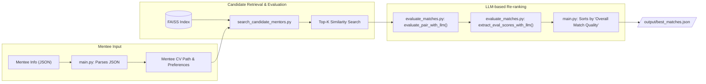

# TCH Mentor-Matching

This project is a comprehensive pipeline designed to match mentees with suitable mentors based on their professional profiles and research interests. It leverages Large Language Models (LLMs) for summarization, evaluation, and vector embeddings to find the best possible matches from a corpus of mentor CVs.

## Dataflow Diagrams

### 1. Data Processing and Indexing (One-Time Setup)

This initial pipeline processes raw mentor CVs, summarizes them, and builds a searchable FAISS vector index. This only needs to be run once or when the mentor pool changes.

```mermaid
flowchart LR
    A["Mentor CVs (PDFs/DOCX)"] --> B["io_utils: load_documents()"];
    B --> C["text_utils: clean_and_validate_text()"];
    C --> D["main.py: Caches to mentor_data.csv"];
    D --> E["batch.py: summarize_cvs()"];
    E --> F["main.py: Caches to mentor_data_with_summaries.csv"];
    F --> G["build_index.py: build_index()"];
    G --> H["utils.py: find_professor_type() & rank_professors()"];
    H --> I["main.py: Caches to mentor_data_summaries_ranks.csv"];
    I --> J["build_index.py: Creates FAISS Index"];
    J --> K[("db/embedding-model-name/index.faiss")];
```



### 2. Mentee Matching (Per-Mentee Execution)

This pipeline runs for each new mentee to find the best matches from the pre-built index.



## How to Use the Pipeline

### Mentee Input Data Structure

Before running the matching process, you must structure the mentee input data correctly inside the `input/` directory.

1.  **Create a subdirectory for each mentee.** The name of the subdirectory should be the mentee's email address (e.g., `input/john.doe@email.com/`).

2.  **Inside each mentee's subdirectory, add their CV file(s)** (e.g., `.pdf`, `.docx`).

3.  **Add a JSON file containing the mentee's information.** The script will automatically detect and use the first JSON file it finds in the directory. The filename can be anything, but the content must follow this structure:

    ```json
    {
      "first_name": "Katelyn",
      "last_name": "Senkus",
      "role": "Mentee",
      "research_Interest": [
        "Team Science (laboratory and clinical collaborations)",
        "Translational Research (bench-to-bedside)",
        "Lab-based/Bench Research"
      ],
      "submissions_files": [
        "Senkus_CV_3-26-25.docx"
      ]
    }
    ```
    -   `first_name`: The mentee's first name.
    -   `last_name`: The mentee's last name.
    -   `research_Interest`: A list of strings representing the mentee's research interests, ranked in order of preference.
    -   `submissions_files`: A list containing the filename of the CV to be used for matching. The script will find this file within the same directory, even if it has a timestamp prefix (e.g., `1743173574187_Senkus_CV_3-26-25.docx`).

### Running the Pipeline

The entire pipeline is executed from the root directory via the `main.py` script.

#### Command-Line Arguments
-   `--mentees`: **(Required)** Path to the root directory containing mentee subdirectories (e.g., `input/`).
-   `--mentors`: **(Required)** Path to the root directory containing mentor CVs. The script will search this directory and all its subdirectories.
-   `--num_mentors`: **(Required)** The number of initial candidates to retrieve from the similarity search for each mentee.
-   `--overwrite`: **(Optional)** A flag to force the script to ignore all cached files and re-run the entire data processing pipeline from scratch.

#### Example
To run the matching process for all mentees in the `input/` directory:
```bash
uv run main.py --mentees input/ --mentors data/pdfs/ --num_mentors 10
```

### Output Format

The results are saved in `output/best_matches.json`. The output is a list, where each item represents a mentee and their ranked list of mentor matches.

```json
[
  {
    "mentee_name": "Mentee",
    "mentee_email": "Mentee Email",
    "mentee_preferences": [
      "Team Science (laboratory and clinical collaborations)",
      "Translational Research (bench-to-bedside)",
      "Lab-based/Bench Research"
    ],
    "matches": [
      {
        "Mentor Summary": "...",
        "Similarity Score": 0.85,
        "Criterion Scores": {
          "Overall Match Quality": 9.0,
          "Research Interest": 8,
          "Availability": 9,
          "Skillset": 7,
          "Mentee Preferences": 10,
          "Evaluation Summary": "..."
        },
        "metadata": {
          "Mentor_Profile": "...",
          "Professor_Type": "Associate Professor",
          "Rank": 2.0
        }
      }
    ]
  }
]
```
