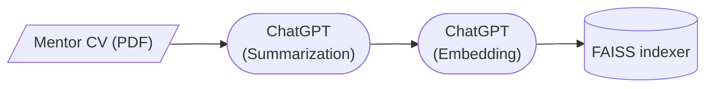
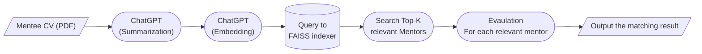

# TCH Mentor-Matching

tech-mentormatching?

## Dataflow diagrams

### Building Database 

### Mentor Search for Mentee

## Notes on some of Brady's files (This can be updated or formatted to your liking or may be unnecessary too)

* `batch_summarize_pdfs.py` - **Preferred method with lots of data** Batch process large volumes of mentor and mentee data using OpenAI's Batch API.
* `summarize_pdfs.py` - Handle smaller or individual summarizing tasks sequentially.
* `generate_text.py` - Contains the generate_text function for generating text summaries using GPT-4.
Usage: Imported and used by both batch_summarize_pdfs.py and summarize_pdfs.py scripts. May be easily incorporated for other broad purposes as well.

