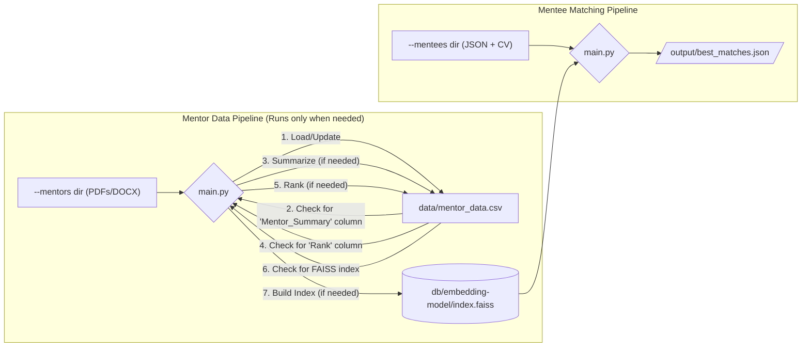

# TCH Mentor-Matching

This project is a comprehensive pipeline designed to match mentees with suitable mentors based on their professional profiles and research interests. It leverages Large Language Models (LLMs) for summarization, evaluation, and vector embeddings to find the best possible matches from a corpus of mentor CVs.

## Dataflow and Caching

The pipeline is designed to be robust and efficient, using a single `data/mentor_data.csv` file as the source of truth for all mentor information. It intelligently checks the state of this file to avoid re-running expensive processing steps.



-   **Intelligent Caching**: The pipeline checks for the existence of `data/mentor_data.csv` and its columns (`Mentor_Summary`, `Rank`) to determine which steps to run. For example, if the `Mentor_Summary` column is already present, the summarization step is skipped.
-   **Atomic Writes**: All updates to `data/mentor_data.csv` are performed atomically to prevent data corruption if the script is interrupted.

## How to Use the Pipeline

### Mentee Input Data Structure

Before running the matching process, you must structure the mentee input data correctly inside the `input/` directory.

1.  **Create a subdirectory for each mentee.** The name of the subdirectory should be the mentee's email address (e.g., `input/john.doe@email.com/`).
2.  **Inside each mentee's subdirectory, add their CV file(s)** (e.g., `.pdf`, `.docx`).
3.  **Add a JSON file containing the mentee's information.** The script uses the first JSON file it finds in the directory. The content must follow this structure:

    ```json
    {
      "first_name": "Katelyn",
      "last_name": "Senkus",
      "research_Interest": [
        "Team Science",
        "Translational Research",
        "Lab-based Research"
      ],
      "submissions_files": ["Senkus_CV_3-26-25.docx"]
    }
    ```

### Running the Pipeline

The entire pipeline is executed from the root directory via the `main.py` script.

#### Command-Line Arguments
-   `--mentees`: **(Required)** Path to the root directory containing mentee subdirectories (e.g., `input/`).
-   `--num_mentors`: **(Required)** The number of initial candidates to retrieve from the similarity search for each mentee.
-   `--mentors`: **(Optional)** Path to the root directory containing mentor CVs. This is **only required** if `data/mentor_data.csv` does not exist or if you are running with the `--overwrite` flag.
-   `--overwrite`: **(Optional)** A flag to force the script to re-run the entire data processing pipeline from scratch, deleting all cached data.

#### Examples

**First-time run or complete re-processing:**
```bash
uv run main.py --mentees input/ --mentors data/pdfs/ --num_mentors 10 --overwrite
```

**Run matching when mentor data is already processed:**
If `data/mentor_data.csv` and the FAISS index are already built, you can run matching for new mentees without providing the `--mentors` directory.
```bash
uv run main.py --mentees input/ --num_mentors 10
```

### Output Format

The results are saved in `output/best_matches.json`. The output is a list, where each item represents a mentee and their ranked list of mentor matches.
```json
[
  {
    "mentee_name": "Individual A",
    "mentee_email": "Email",
    "mentee_preferences": [
      "Team Science",
      "Translational Research",
      "Lab-based Research"
    ],
    "matches": [
      {
        "Mentor Summary": "...",
        "Similarity Score": 0.85,
        "Criterion Scores": {
          "Overall Match Quality": 9.0,
          "Research Interest": 8,
          "Availability": 9,
          "Skillset": 7,
          "Mentee Preferences": 10,
          "Evaluation Summary": "..."
        },
        "metadata": {
          "Mentor_Profile": "...",
          "Professor_Type": "Associate Professor",
          "Rank": 2.0
        }
      }
    ]
  }
]
```
