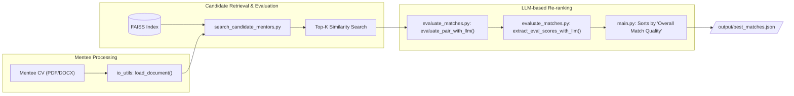

# TCH Mentor-Matching

This project is a comprehensive pipeline designed to match mentees with suitable mentors based on their professional profiles and research interests. It leverages Large Language Models (LLMs) for summarization, evaluation, and vector embeddings to find the best possible matches from a corpus of mentor CVs.

## Dataflow Diagrams

### 1. Data Processing and Indexing

This initial, one-time pipeline processes the raw mentor CVs and builds a searchable vector index.


### 2. Mentee Matching

This pipeline runs for each new mentee to find the best matches from the pre-built index.



## Modules Overview

The project is organized into several modules within the `src/` directory, each with a specific responsibility.

### `src/processing`
Handles the initial ingestion and cleaning of data.
-   **`io_utils.py`**: Contains functions to extract raw text from various file formats (`.pdf`, `.docx`, `.txt`). It recursively searches directories to find all mentor profiles.
-   **`text_utils.py`**: Provides utilities to clean and validate the extracted text. It removes boilerplate, normalizes whitespace, and ensures the text is substantial enough for summarization.
-   **`batch.py`**: Manages the expensive summarization step by preparing and sending data to the OpenAI Batch API.

### `src/retrieval`
Manages the creation and use of the vector database.
-   **`build_index.py`**: The core of the data processing pipeline. It reads the summarized mentor data, enriches it with professor type and rank, and then uses the embeddings to build and save the FAISS vector index.
-   **`search_candidate_mentors.py`**: Takes a mentee's profile, generates an embedding, and performs a similarity search against the FAISS index to retrieve the most relevant mentor candidates.

### `src/eval`
Performs the final, detailed evaluation of potential matches.
-   **`evaluate_matches.py`**: Uses a powerful LLM (e.g., GPT-4o) to perform a nuanced evaluation of a mentor-mentee pair. It scores the match based on multiple criteria (research interest, skills, availability) and generates a final **"Overall Match Quality"** score, which is used for the final ranking.

### `src/config`
Centralizes all project configurations.
-   **`paths.py`**: Defines all important file and directory paths, dynamically creating the index path based on the embedding model being used.
-   **`model.py`**: Specifies the LLM and embedding models used throughout the pipeline.
-   **`prompts.py`**: Stores the system prompts that guide the LLMs during summarization and evaluation tasks.

## How to Use the Pipeline

The entire pipeline is executed from the root directory via the `main.py` script.

### Entry Point: `main.py`
This script is the orchestrator. It contains intelligent caching logic, checking for the existence of output files at each major step (`mentor_data.csv`, `mentor_data_with_summaries.csv`, etc.). It will only run the necessary processing steps, saving time and cost on subsequent runs.

### Command-Line Arguments
-   `--mentees`: **(Required)** Path to the directory containing mentee CVs.
-   `--mentors`: **(Required)** Path to the root directory containing mentor CVs. The script will search this directory and all its subdirectories.
-   `--num_mentors`: **(Required)** The number of initial candidates to retrieve from the similarity search for each mentee.
-   `--overwrite`: **(Optional)** A flag to force the script to ignore all cached files and re-run the entire data processing pipeline from scratch.

### Example

To run the matching process for all mentees in the `input/` directory:
```bash
uv run main.py --mentees input/ --mentors data/pdfs/ --num_mentors 10
```

If you need to force a complete reprocessing of all mentor data, use the `--overwrite` flag:
```bash
uv run main.py --mentees input/ --mentors data/pdfs/ --num_mentors 10 --overwrite
```
